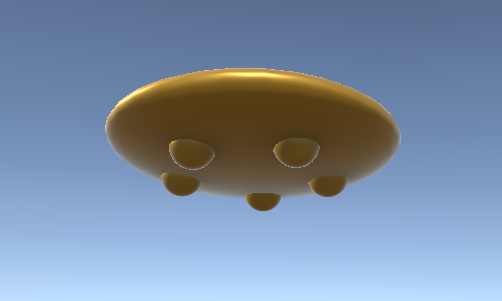

# Kirby

Authors: Luis Velazquez Sosa, Edward Garcia

Date: 2023-08-08

Personal Stories with Kirby
---
Luis:
I remember my first game console was a Gameboy Advance and one of the games I had was "Kirby's Dream Land". I remember playing Kirby and how fun it was seeing how he gained the abilities. I remember spending a lot of time playing and absorbing everything. I had friends that also played and we played together all the time. 

---
For the height using the map of Puerto Rico, I went to the [website](https://tangrams.github.io/heightmapper) suggested by the professor and made captures of the area most interesting to me. Once I had the location I captured it. But when I went to the Unity the size of the image had to be squared, or in other words, both sizes had to have the same pixel length. I used a free open-source software called GIMP that help me edit images. I used the cropping tool and changed the aspect ratio from 16:9 to 1:1. This gave me an image with equal width and height dimensions. After this, I exported the image to PNG format and imported it to Unity. 

I then in Unity had to change the terrain dimensions to 250 x 250 x 250. Once I did this I noticed that the terrain had peaks and valleys too extreme. I noticed a setting called height remap that made the ability to change how drastically the peaks and valleys were. Once I set the value to where I felt correct I created the terrain.

 

We tested other parts of Puerto Rico but we came to a conclusion and chose Arecibo for its dynamic terrain. 

Creating UFO Kirby was not too difficult but it presented some challenges. I used the prefab of Kirby to create a prefab variant. I removed most of the limbs of Kirby. I used a sphere and scaled the y-axis down to create a disk shape. after that, I made five small spheres in the bottom of the disk to make it more of a UFO.

 

After this, the Kirby body is put inside of the UFO with the head sticking out. 

Creating Hammer Kirby was fun for a few reasons. When creating Hammer Kirby using the default prefab the expression of anger in Kirby I created brows that were derived from the mouth. The hands were moved to the center and down of the body. The legs had to be moved to the side and rotated up slightly. The addition of the headband is similar to the UFO in that we chose to have a disk shape and clipped it into Kirby’s head. the two strings from the headband were made with capsules. The headband was all colored white by creating a new color in the materials section. The hammer was created with two cylinders and colored with a new material brown referenced by the image online from Kirby’s website.  

